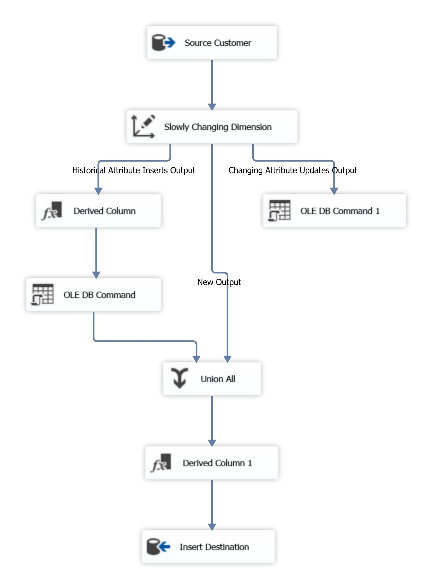

<h1 align="center">Implementing a Data Warehouse using SQL</h1>
<p align="center">
The backend database used in this implementation is <a href="https://github.com/Microsoft/sql-server-samples/releases/tag/wide-world-importers-v1.0">Wide World Importers sample database v1.0</a> by microsoft
</p>
<p align="center">The DBMS used in this implementation is SQL server 2017</p>
<hr>

## 1 Design and Implement Dimension Tables
Dimensions describes the core business concepts contained in a data warehouse through the use of **attributes**
and these attributes are used to define heirarchies which provide both navigitional paths as well as grouping for analysis
### Dimension is a core business concept
- Person, Place, Thing, Event
	- *e.g.,* customer, Order, Sales Transaction, Service, city, product, ...
- provides context to the fact
	- the concept itself it has a decriptors so the product has a name, and it is part of a category, and it was provided by a vendor so it has charactersitcs that defines it 
- Attributes define these charactersitcs of the dimension

So if I know that a product was sold in a certain store, and that store in a city, and that city in a state, and that state in a country then I can analyze my fact not only by the product iself but with the city, the vendor, the employee, the customer so I can begin to understand and have a context to my facts

### Attributes
- Specific, unique characteristics of the dimension
- Used for filtering and grouping data
- May change over time
- Can be arranged in a Heirarchical structure

`Heirarchical example`

 If I have an ***additive messure*** like revenue, I have revenue in a particular postal code, and if i take all the postal codes for the city and aggregate them up then I have the revenue in the whole city so the hierarchies are both navigitional as well as aggregational.

### To create Dimension Tables
- Define core business concept
- Define Attributes
- Define Hierarchies

### keys and relationships
#### Business key
- Business defined unique reference to a dimension member (could be one or more column)
- Typically defined in the source but may be derived 
- Example: customerID, Student number, Product code
#### Surrogate key
- Not defined in the source, created in the data warehosue
- Unique identifier (primary key) supporting slowly changing dimension functionality
- Foreign key reference in fact tables
##### Foreign keys
May be reference to Business key or surrogate key, Business key for current version and surrogate key for point-in-time version

### Slowly changing dimension
The SCD concept is all about reporting our data with historical accuracy.
I need to be able to capture the fact that up to a certain point in time.
#### Slowly changing attributes
- Attributes that may change over time
- Types of anticipated change
	- **Type 0** - attribute not expected to change
		- *e.g.,* SSN, hire date, place of birth
		- *processing* - refuse update, alert on attempt to update
	- **Type 1** - attribute may change, historical value not retained
		- *e.g.,* mobile phone number, emergincy contact
		- *processing* - update attribute in place
	- **type 2** - attribute may change, historical value retained
		- *e.g.,* vendor type, title, region
		- *processing* - set current record a obsolete, create a new record
- For tracking the history 
	- Add and Effective and obsolete date columns
	- Is current (optional)
- The precedence of execution
	- Is it a new record -> Then it's a simple insertion
	- Type 2 -> Ignore type 1 attributes, obsolete the record, make a new one, the type 1 will be applyed in the new record
	- type 1 -> simply apply updates

### Hands ON Dimensions
The business need to understand the invoicing activity so, Let's take a look at our invoice source table 

```SQL
-- Sales Invoice Transaction Detail
SELECT * FROM "WideWorldImporters"."Sales"."InvoiceLines" WHERE "InvoiceLineID" = 1;
```

|InvoiceLineID|	InvoiceID|	StockItemID|	Description|	PackageTypeID|	Quantity|	UnitPrice|	TaxRate|	TaxAmount|	LineProfit|	ExtendedPrice|	LastEditedBy|	LastEditedWhen|
|---|---|----|----|---|---|---|---|---|---|---|---|---|
|1|	1|	67|	Ride on toy sedan car (Black) 1/12 scale|	7|	10|	230.00|	15.000|	345.00|	850.00|	2645.00	|7|	2013-01-01| 12:00:00.0000000|

In this case we have a single product in an invoice, this happen to be a 'Ride on toy sedan car (black) 1/12 scale', quantity of 10, unit price = 230.00 and Extended price = 2645.00.
It's good to know that we have these messures.
But what we need to look for are core business concepts, what are the descriptors of these messures, so what I have here is an invoiceID and it sounds like a dimension, It's a core concept. And I have a product.
So I have a relation to 2 core concept an `invoice` concept and a `product` concept

<br>

let's look at the invoice
```SQL
-- Sales Invoice Transaction
SELECT * FROM "WideWorldImporters"."sales"."Invoices" WHERE "InvoiceID" = 1;

```
| InvoiceID | CustomerID | BillToCustomerID | OrderID | DeliveryMethodID | ContactPersonID | AccountsPersonID | SalespersonPersonID | PackedByPersonID | InvoiceDate         | CustomerPurchaseOrderNumber | IsCreditNote | CreditNoteReason | Comments | DeliveryInstructions     | InternalComments | TotalDryItems | TotalChillerItems | DeliveryRun | RunPosition | ReturnedDeliveryData                                                                                                                                                                                                                                                     | ConfirmedDeliveryTime      | ConfirmedReceivedBy | LastEditedBy | LastEditedWhen                |
|-----------|------------|------------------|---------|------------------|-----------------|------------------|---------------------|------------------|---------------------|------------------------------|--------------|------------------|----------|--------------------------|------------------|---------------|-------------------|-------------|-------------|-------------------------------------------------------------------------------------------------------------------------------------------------------------------------------------------------------------------------------------------------------------------------|----------------------------|----------------------|--------------|------------------------------|
| 1         | 832        | 832              | 1       | 3                | 3032            | 3032             | 2                   | 14               | 2013-01-01          | 12126                        | 0            | NULL             | NULL     | Suite 24, 1345 Jun Avenue | NULL             | 1             | 0                 | NULL        | NULL        | {"Events": [{ "Event":"Ready for collection","EventTime":"2013-01-01T12:00:00","ConNote":"EAN-125-1051"},{ "Event":"DeliveryAttempt","EventTime":"2013-01-02T07:05:00","ConNote":"EAN-125-1051","DriverID":15,"Latitude":41.3617214,"Longitude":-81.4695602,"Status":"Delivered"}],"DeliveredWhen":"2013-01-02T07:05:00","ReceivedBy":"Aakriti Byrraju"} | 2013-01-02 07:05:00.0000000 | Aakriti Byrraju     | 15           | 2013-01-02 07:00:00.0000000 |

Each invoice has a collection of data and each invoice item has a seperate collection of data, The invoice is more rich in terms of the dimensional relationship because I have the customer, the order, the delivery method, the contact person and these all represent tables in my environment.

<br>

Let's pull out a candidate dimension and I focus now on the customer and I have a convenient customer table in my environment.

```SQL
-- Customer
SELECT TOP(3) * FROM "WideWorldImporters"."sales"."Customers";
```
| CustomerID | CustomerName                    | BillToCustomerID | CustomerCategoryID | BuyingGroupID | PrimaryContactPersonID | AlternateContactPersonID | DeliveryMethodID | DeliveryCityID | PostalCityID | CreditLimit | AccountOpenedDate | StandardDiscountPercentage | IsStatementSent | IsOnCreditHold | PaymentDays | PhoneNumber   | FaxNumber     | DeliveryRun | RunPosition | WebsiteURL                        | DeliveryAddressLine1 | DeliveryAddressLine2 | DeliveryPostalCode | DeliveryLocation | PostalAddressLine1 | PostalAddressLine2 | PostalPostalCode | LastEditedBy | ValidFrom                | ValidTo                   |
|------------|---------------------------------|------------------|--------------------|---------------|------------------------|--------------------------|------------------|----------------|--------------|-------------|-------------------|---------------------------|-----------------|----------------|-------------|---------------|---------------|-------------|-------------|----------------------------------|----------------------|----------------------|---------------------|------------------|--------------------|--------------------|------------------|--------------|--------------------------|--------------------------|
| 1          | Tailspin Toys (Head Office)     | 1                | 3                  | 1             | 1001                   | 1002                     | 3                | 19586          | 19586        | NULL        | 2013-01-01        | 0.000                     | 0               | 0              | 7           | (308) 555-0100 | (308) 555-0101 |             |             | http://www.tailspintoys.com    | Shop 38              | 1877 Mittal Road     | 90410               | 0xE6100000010CE73F5A52A4BF444010638852B1A759C0 | PO Box 8975          | Ribeiroville        | 90410            | 1            | 2013-01-01 00:00:00.0000000 | 9999-12-31 23:59:59.9999999 |
| 2          | Tailspin Toys (Sylvanite, MT)  | 1                | 3                  | 1             | 1003                   | 1004                     | 3                | 33475          | 33475        | NULL        | 2013-01-01        | 0.000                     | 0               | 0              | 7           | (406) 555-0100 | (406) 555-0101 |             |             | http://www.tailspintoys.com/Sylvanite | Shop 245             | 705 Dita Lane        | 90216               | 0xE6100000010CF37A8BE2B05B4840056FA35CF5F75CC0 | PO Box 259           | Jogiville           | 90216            | 1            | 2013-01-01 00:00:00.0000000 | 9999-12-31 23:59:59.9999999 |
| 3          | Tailspin Toys (Peeples Valley, AZ) | 1             | 3                  | 1             | 1005                   | 1006                     | 3                | 26483          | 26483        | NULL        | 2013-01-01        | 0.000                     | 0               | 0              | 7           | (480) 555-0100 | (480) 555-0101 |             |             | http://www.tailspintoys.com/PeeplesValley | Unit 217             | 1970 Khandke Road    | 90205               | 0xE6100000010CC97553CA6B2241404FACF82B892E5CC0 | PO Box 3648          | Lucescuville        | 90205            | 1            | 2013-01-01 00:00:00.0000000 | 9999-12-31 23:59:59.9999999 |


Now we begin to touch on the concept of a hierarchy, a number of customers would group into a particular category or into a buying group and these are the attributes we rollup to give us aggregational values, we also have a primary contact, Delivery Method and Delivery City.
So I start to have an understanding of what are the descriptors of a customer.

<br>

let's pick a few attributes to build a `conformed` customer dimension table

```SQL
select
-- Customer Dimension
select
	cu.CustomerID
	, cu.CustomerName
	, bg.BuyingGroupName
	, ci.CityName
	, sp.StateProvinceCode
	, sp.StateProvinceName
	, co.CountryName
	, cu.CreditLimit
from
	WideWorldImporters.sales.Customers cu
	left outer join WideWorldImporters.sales.BuyingGroups bg on bg.BuyingGroupID = cu.BuyingGroupID
	left outer join WideWorldImporters.[Application].cities ci on ci.CityID = cu.DeliveryCityID
	left outer join WideWorldImporters.[Application].StateProvinces sp on sp.StateProvinceID = ci.StateProvinceID
	left outer join WideWorldImporters.[Application].Countries co on co.CountryID = sp.CountryID
```

| CustomerID | CustomerName                    | BuyingGroupName | CityName        | StateProvinceCode | StateProvinceName | CountryName    | CreditLimit |
|------------|---------------------------------|-----------------|-----------------|-------------------|-------------------|----------------|-------------|
| 1          | Tailspin Toys (Head Office)     | Tailspin Toys   | Lisco           | NE                | Nebraska          | United States | NULL        |
| 2          | Tailspin Toys (Sylvanite, MT)  | Tailspin Toys   | Sylvanite       | MT                | Montana           | United States | NULL        |
| 3          | Tailspin Toys (Peeples Valley, AZ) | Tailspin Toys | Peeples Valley  | AZ                | Arizona           | United States | NULL        |

<br>
To be able to build a date dimension table we need to know the range of our invoice date transactions.

```SQL
-- Invoice Date Range
select min(InvoiceDate) as minDate,  max(InvoiceDate) as maxDate from WideWorldImporters.Sales.Invoices
```
| minDate   | maxDate   |
|-----------|-----------|
| 2013-01-01| 2016-05-31|

<br>

**SCD handling in SSIS package for customer dimension**
`Buying group` is type 2 and the rest are type 1


To Test the SSIS package
```SQL
-- the customer in the source and the warehosue
select * from WideWorldImporters.sales.Customers where CustomerID = 915
select * from dbo.dimCustomer where CustomerID = 915
```
| CustomerID | CustomerName | BillToCustomerID | CustomerCategoryID | BuyingGroupID | PrimaryContactPersonID | AlternateContactPersonID | DeliveryMethodID | DeliveryCityID | PostalCityID | CreditLimit | AccountOpenedDate | StandardDiscountPercentage | IsStatementSent | IsOnCreditHold | PaymentDays | PhoneNumber   | FaxNumber     | DeliveryRun | RunPosition | WebsiteURL                             | DeliveryAddressLine1 | DeliveryAddressLine2 | DeliveryPostalCode | DeliveryLocation | PostalAddressLine1 | PostalAddressLine2 | PostalPostalCode | LastEditedBy | ValidFrom                | ValidTo                   |
|------------|--------------|-------------------|--------------------|---------------|------------------------|--------------------------|------------------|----------------|--------------|-------------|-------------------|---------------------------|-----------------|----------------|-------------|---------------|---------------|-------------|-------------|---------------------------------------|----------------------|----------------------|---------------------|------------------|--------------------|--------------------|------------------|--------------|--------------------------|--------------------------|
| 915        | Ana Florea   | 915               | 7                  | NULL          | 3115                   | NULL                     | 3                | 4430           | 4430         | 1984.50     | 2013-01-01        | 0.000                     | 0               | 0              | 7           | (210) 555-0100 | (210) 555-0101 |             |             | http://www.microsoft.com/AnaFlorea/ | Shop 3               | 1898 Pokorna Boulevard | 90140               | 0xE6100000010CEC1FFAA4C9D93E404E548039C49C58C0 | PO Box 3140          | Rautville          | 90140            | 15           | 2015-07-01 16:00:00.0000000 | 9999-12-31 23:59:59.9999999 |

| CustomerSK | CustomerID | CustomerName | BuyingGroupName | CityName            | StateProvinceCode | StateProvinceName | CountryName    | CreditLimit | effectiveDate          | obsoleteDate           |
|------------|------------|--------------|-----------------|---------------------|-------------------|-------------------|----------------|-------------|------------------------|------------------------|
| 82         | 915        | Ana Florea   | NULL            | Buchanan Lake Village| TX                | Texas             | United States | 1984.50     | 2013-01-08 00:00:00.000| NULL                   |

update on the type 2 attribute, then running the package
```SQL
-- Update BuyingGroup
update WideWorldImporters.sales.customers set BuyingGroupID = 1 where CustomerID = 915
select * from WideWorldImporters.sales.Customers where CustomerID = 915
select * from dbo.dimCustomer where CustomerID = 915
```
Here is the dimesnion in the warehouse
| CustomerSK | CustomerID | CustomerName | BuyingGroupName | CityName            | StateProvinceCode | StateProvinceName | CountryName    | CreditLimit | effectiveDate          | obsoleteDate           |
|------------|------------|--------------|-----------------|---------------------|-------------------|-------------------|----------------|-------------|------------------------|------------------------|
| 82         | 915        | Ana Florea   | NULL            | Buchanan Lake Village| TX                | Texas             | United States | 1984.50     | 2013-01-08 00:00:00.000| 2024-04-09 18:19:35.000|
| 664        | 915        | Ana Florea   | Tailspin Toys   | Buchanan Lake Village| TX                | Texas             | United States | 1984.50     | 2024-04-09 18:19:35.000| NULL                   |

update on type 1 attribute, then running the package
```SQL
update WideWorldImporters.sales.customers set CustomerName = 'Ana Florea Enterprises' where CustomerID = 915
select * from WideWorldImporters.sales.Customers where CustomerID = 915
select * from dbo.dimCustomer where CustomerID = 915
```
And here's simple update on change in just the effective record 
| CustomerSK | CustomerID | CustomerName         | BuyingGroupName | CityName            | StateProvinceCode | StateProvinceName | CountryName    | CreditLimit | effectiveDate          | obsoleteDate           |
|------------|------------|----------------------|-----------------|---------------------|-------------------|-------------------|----------------|-------------|------------------------|------------------------|
| 82         | 915        | Ana Florea           | NULL            | Buchanan Lake Village| TX                | Texas             | United States | 1984.50     | 2013-01-08 00:00:00.000| 2024-04-09 18:19:35.000|
| 664        | 915        | Ana Florea Enterprises| Tailspin Toys  | Buchanan Lake Village| TX                | Texas             | United States | 1984.50     | 2024-04-09 18:19:35.000| NULL                   |

